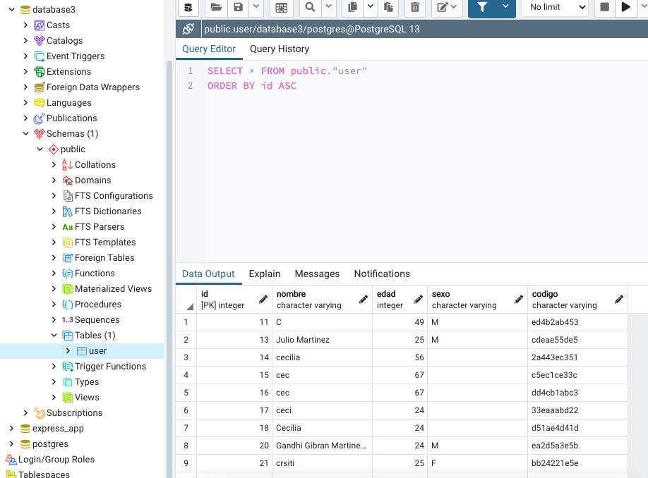
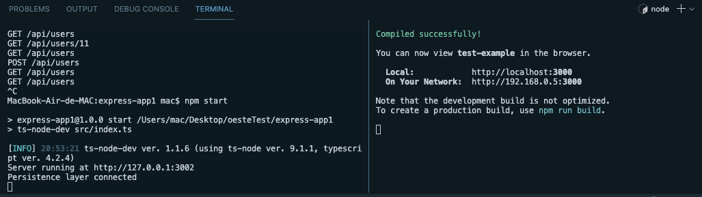
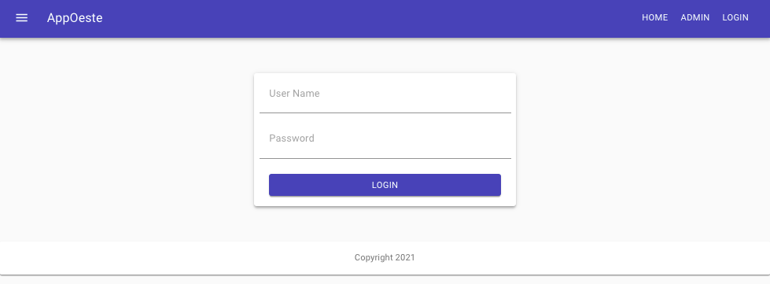
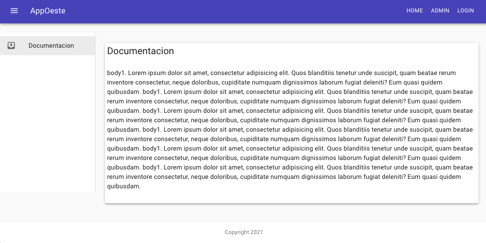
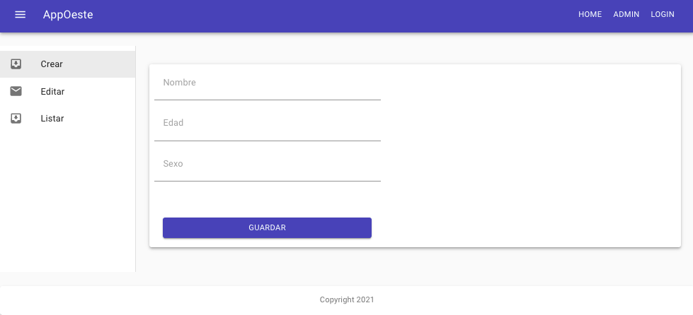
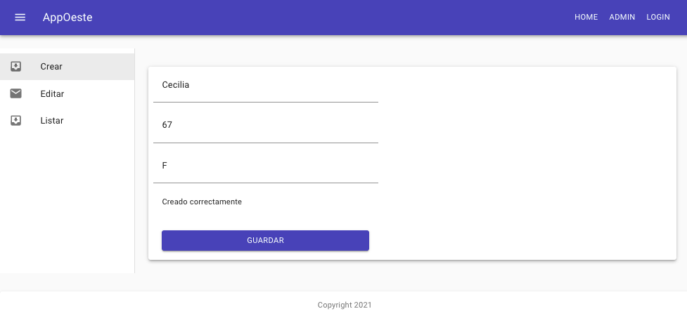
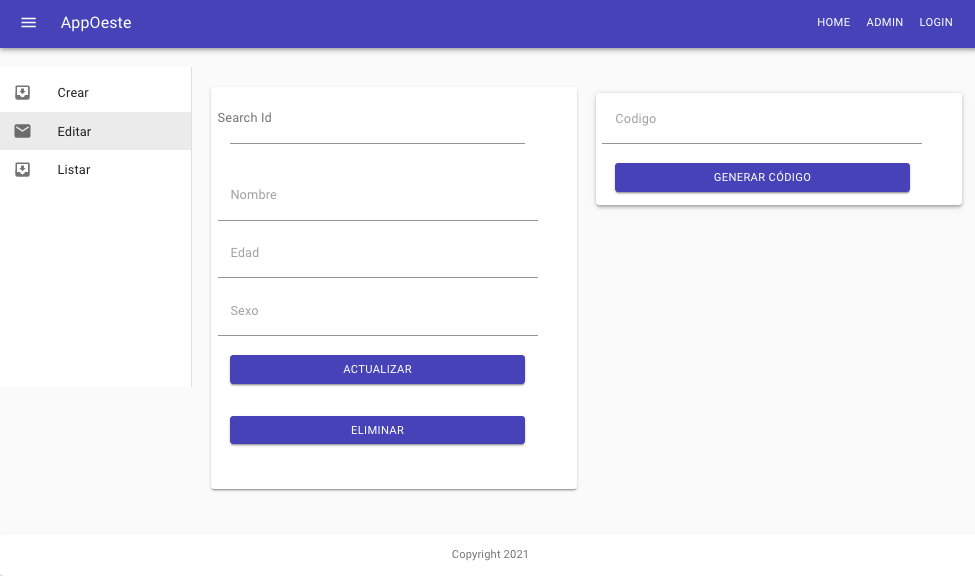
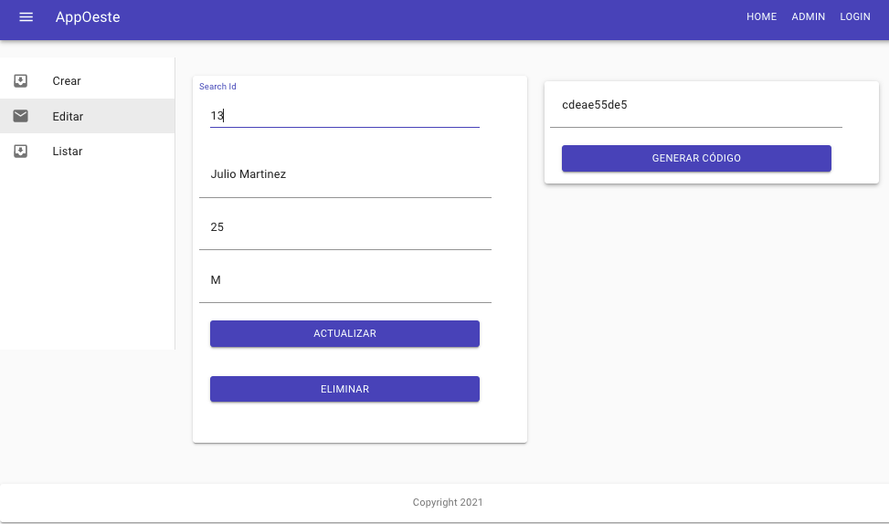
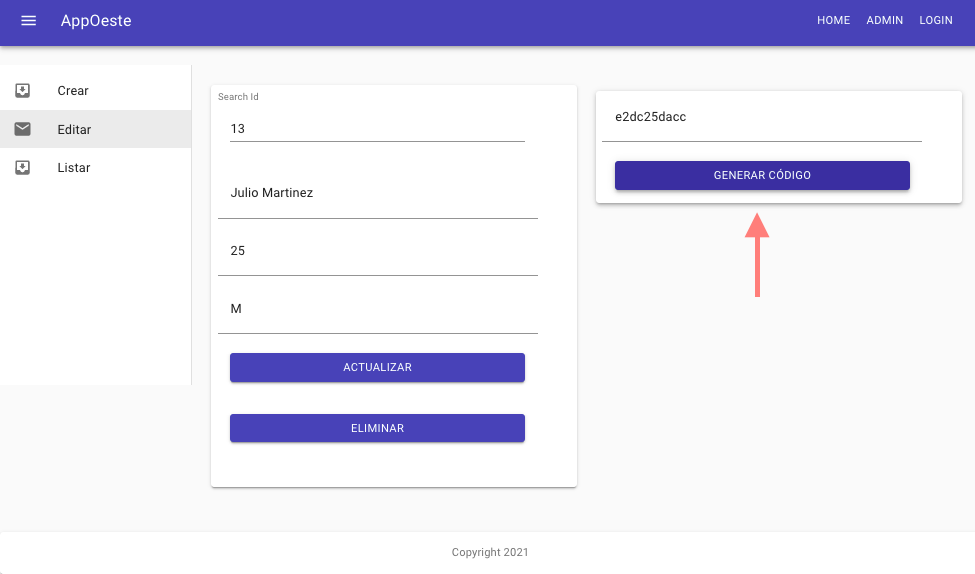
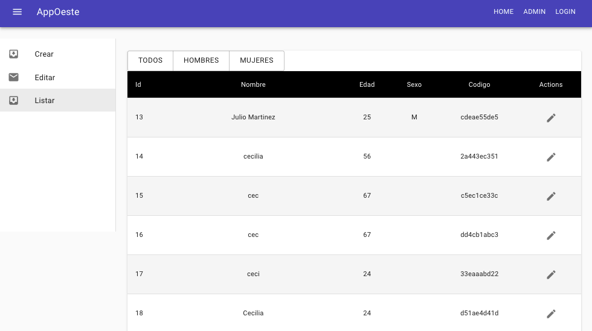

# Como correr mi proyecto
En el presente proyecto encontraras dos archivos:
- express-app1
- react-app

Crea un archivo .env (lo encontraras en el archivo express-app1) con la siguiente informacion, para la conexion a base de datos :
```
SERVER_PORT=3002
SERVER_HOST= 127.0.0.1
POSTGRES_HOST="localhost"
POSTGRES_PORT=5432
POSTGRES_USERNAME=postgres 
POSTGRES_PASSWORD=admin //Password de tu base 
POSTGRES_DATABASE=database3  //Nombre de la base de datos
```


Ingresa a ambas carpetas en diferentes terminale y ejecuta en ambas terminales el siguiente comando:
```npm start```

Se debe ver de la siguiente manera:


# Componentes

## Login 


## Admin


## Home


### Home crear


### Home editar




### Home listar


# Librerias usadas
```
"dependencies": {
    "@material-ui/core": "^4.11.3",
    "@material-ui/icons": "^4.11.2",
    "@testing-library/jest-dom": "^5.11.10",
    "@testing-library/react": "^11.2.6",
    "@testing-library/user-event": "^12.8.3",
    "@types/react-router-dom": "^5.1.7",
    "axios": "^0.21.1",
    "class-transformer": "^0.4.0",
    "class-validator": "^0.13.1",
    "fontsource-roboto": "^4.0.0",
    "node-sass": "^4.14.1",
    "react": "^17.0.2",
    "react-dom": "^17.0.2",
    "react-router": "^5.2.0",
    "react-router-dom": "^5.2.0",
    "react-scripts": "4.0.3",
    "typescript": "^4.3.2",
    "web-vitals": "^1.1.1"
  },
  ```
